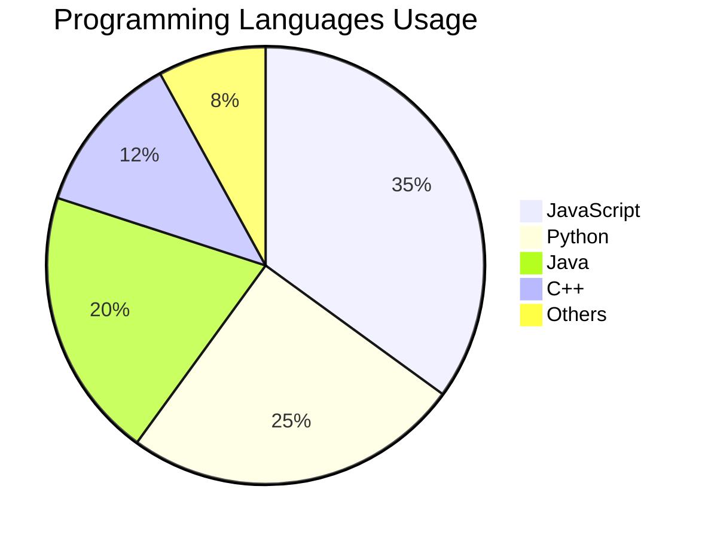

test
# Markdown Cheatsheet

## Headers
# H1
## H2
### H3
#### H4
##### H5
###### H6


## Emphasis
**Bold** or __Bold__
*Italic* or _Italic_
***Bold Italic***
~~Strikethrough~~

## Lists
### Unordered
- Item 1
- Item 2
  - Sub Item 2a
  - Sub Item 2b

### Ordered
1. First
2. Second
3. Third

### Task List
- [x] Done task
- [ ] Todo task

## Links & Images
[Link Text](https://example.com)


## Code
Inline `code` example.

```javascript
// Code block
function hello() {
  console.log("Hello World");
}
```

## Tables
| Header 1 | Header 2 | Header 3 |
| ------- | ------ | ------- |
| Cell 1   | Cell 2   | Cell 3   |
| Cell 4   | Cell 5   | Cell 6   |

## Blockquotes
> This is a blockquote.
>
> > Nested blockquote.

## Math (KaTeX)
Inline: $E = mc^2$

Block:
$$
\oint_C \vec{B} \cdot d\vec{l} = \mu_0 I_{enc}
$$

## Horizontal Rule
---


## Footnotes
Here is a footnote reference[^1].

[^1]: Here is the footnote.

## Chart



## HTML Support
<div style="background-color: #e8f4fd; padding: 15px; border-left: 4px solid #2196F3; border-radius: 4px; color: green;">
  <p>This is a <strong>HTML div element</strong> with inline styles.</p>
</div>
